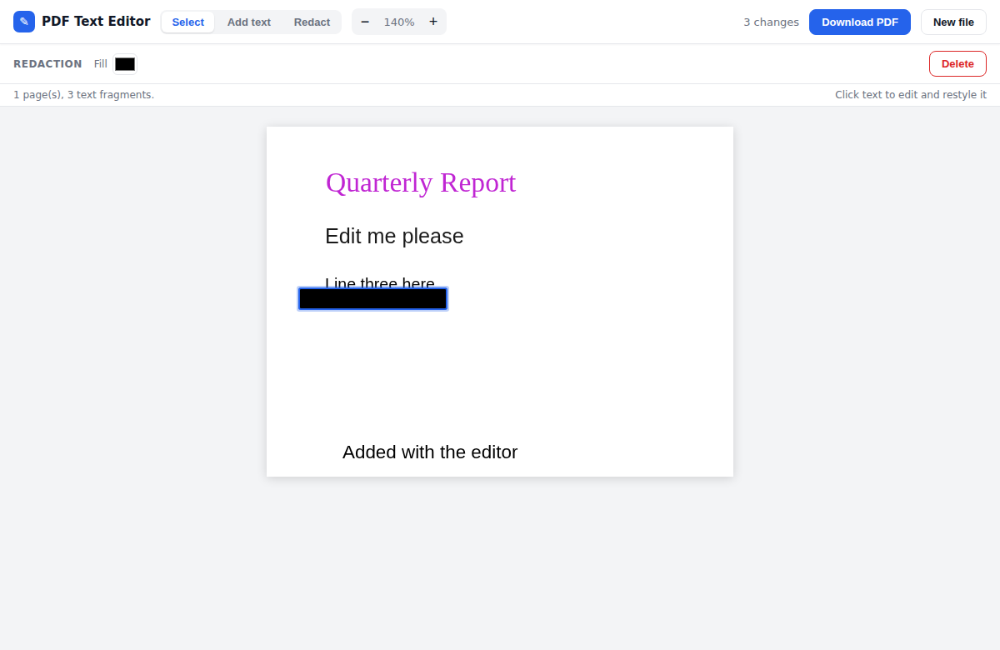

# PDF Text Editor

Upload a PDF, edit its text directly on the page, restyle it, add new text,
redact regions, and download the result — entirely in your browser. No server,
no uploads, no accounts.



## Features

- **Edit existing text** — click any text run and type over it in place.
- **Restyle text** — change font (Sans / Serif / Mono), **bold**, *italic*,
  size, and colour for the selected text or text box.
- **Add new text** — the *Add text* tool drops a text box anywhere you click.
- **Redact** — the *Redact* tool draws a solid box over a region and truly
  removes the underlying content on export (see below).
- **Download** — writes your changes back to a new PDF, preserving everything
  you didn't touch.

Everything runs locally with the [File API]; the PDF never leaves your machine.

## How it works

1. **Render** — [PDF.js] rasterises each page to a `<canvas>` and extracts the
   text fragments with their exact positions and fonts.
2. **Edit** — each fragment gets a transparent `contentEditable` overlay
   aligned to its glyphs. Editing or restyling a fragment paints an opaque box
   over the original so the preview matches the export. New text boxes and
   redactions are tracked as overlays too.
3. **Export** — [pdf-lib] produces the output page by page:
   - Pages **without** redactions keep their original vector content; edits and
     new text boxes are drawn on top (original glyphs are covered and redrawn).
   - Pages **with** redactions are flattened: the page is re-rendered to a
     high-resolution image with all edits, text boxes, and redaction fills
     baked in, and that image replaces the page. Because only the raster
     survives, redacted content is genuinely gone — there is no hidden text
     layer to recover.

## Getting started

```bash
npm install
npm run dev      # start the dev server
npm run build    # type-check + production build to dist/
npm run preview  # serve the production build
```

Then open the printed URL and drop in a PDF.

## Using the editor

| Tool | What it does |
| --- | --- |
| **Select** | Click text to edit it; use the properties bar to restyle. Click a text box or redaction to select it (Delete removes it). |
| **Add text** | Click anywhere on a page to drop a new text box, then type. |
| **Redact** | Drag a rectangle over the content to remove. Pick its fill colour in the properties bar. |

## Project layout

```
src/
  pdf/
    types.ts      shared TypeScript types
    style.ts      font/style resolution + colour helpers
    loader.ts     parse + render pages with PDF.js
    exporter.ts   write edits/text/redactions back with pdf-lib
  components/
    PageView.tsx          one page: canvas + editable overlay + tools
    EditableFragment.tsx  a single in-place editable text run
    TextBoxItem.tsx       a user-added text box
    RedactionItem.tsx     a redaction rectangle
    PropertiesPanel.tsx   contextual font/colour/size controls
  App.tsx         upload, toolbar, viewer, download orchestration
```

## Limitations

A pragmatic, client-side editor — worth knowing where the seams are:

- **Text edits on non-redacted pages are drawn over, not deleted.** An edited
  fragment is covered with a white rectangle and the new text is drawn on top;
  the original glyphs still exist in the content stream. Use **Redact** (which
  flattens the page) if you need content to actually be removed.
- **Redacting flattens the whole page to an image.** That page loses its
  selectable text layer and its file size grows. Pages you don't redact keep
  full vector quality and selectable text.
- **Fonts are approximated.** Text is drawn with the closest standard font
  (Helvetica / Times / Courier, with bold & italic). Edited text supports only
  WinAnsi-encodable characters.
- **White background assumed** behind edited text on non-redacted pages;
  coloured or image backgrounds will show a white patch. (Redaction fill colour
  is configurable.)
- **Layout is not reflowed**, images/vector graphics aren't editable, rotated
  text isn't repositioned in the overlay, and scanned PDFs have no text layer
  to edit.

## Tech

React · TypeScript · Vite · [PDF.js] · [pdf-lib]

[File API]: https://developer.mozilla.org/en-US/docs/Web/API/File
[PDF.js]: https://mozilla.github.io/pdf.js/
[pdf-lib]: https://pdf-lib.js.org/
