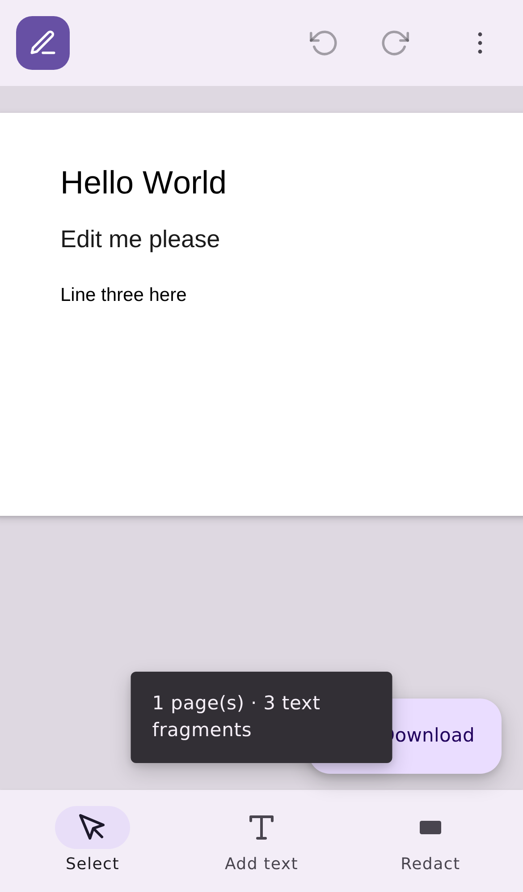

# PDF Editor

A full client-side PDF editor: edit and restyle text, add text, draw and
annotate, sign, redact, organize pages, and add finishing touches — then
download the result. Everything runs **entirely in your browser**. No server,
no uploads, no accounts.


## Design & platforms

The UI is built on **Material 3 Expressive** design tokens (color roles with
light/dark, the expressive shape scale, the M3 type scale, and motion easings)
and is **mobile- and tablet-first**:

- **Responsive shell** — a bottom app bar + extended FAB + bottom-sheet
  properties on phones; a tool rail + persistent side panel on tablet/desktop.
- **Touch-first canvas** — one finger pans/scrolls (never edits by accident),
  two fingers pinch-zoom, double-tap toggles fit ⇄ 2×, with app-managed
  zoom anchoring and 48px touch targets / enlarged drag handles on touch.
- **Self-contained** — inline SVG icons and graceful system-font fallback, so
  the UI renders fully even if web fonts are blocked or offline.



## Features

- **Edit existing text** — click any text run and type over it in place.
- **Restyle text** — change font (Sans / Serif / Mono), **bold**, *italic*,
  size, and colour for the selected text or text box.
- **Add new text** — the *Add text* tool drops a text box anywhere you click.
- **Move & resize** — drag text boxes and redactions to reposition them, and
  drag their handles to resize (redactions resize as a rectangle; text boxes
  scale their font size).
- **Annotate & draw** — highlighter, freehand pen, shapes (rectangle / line /
  arrow), and sticky notes, with adjustable colour and stroke width.
- **Fill & Sign** — create a signature by drawing, typing (script font), or
  uploading an image, then tap to place it; insert any image the same way.
  Stamps are draggable and resizable.
- **Redact** — the *Redact* tool draws a solid box over a region and truly
  removes the underlying content on export (see below).
- **Organize pages** — a thumbnail view to reorder, rotate, and delete pages,
  merge in another PDF, or extract selected pages to a new file.
- **Finishing touches** — add page numbers, stamp a diagonal watermark, or
  export every page as a PNG image.
- **Undo / redo** — full history with <kbd>Ctrl/⌘</kbd>+<kbd>Z</kbd> and
  <kbd>Ctrl/⌘</kbd>+<kbd>Shift</kbd>+<kbd>Z</kbd> (continuous gestures like
  dragging, resizing, and typing collapse into single steps).
- **Download** — writes your changes back to a new PDF, preserving everything
  you didn't touch.

Everything runs locally with the [File API]; the PDF never leaves your machine.

## How it works

1. **Render** — [PDF.js] rasterises each page to a `<canvas>` and extracts the
   text fragments with their exact positions and fonts.
2. **Edit** — each fragment gets a transparent `contentEditable` overlay
   aligned to its glyphs. Editing or restyling a fragment paints an opaque box
   over the original so the preview matches the export. New text boxes and
   redactions are tracked as overlays too.
3. **Export** — [pdf-lib] produces the output page by page:
   - Pages **without** redactions keep their original vector content; edits and
     new text boxes are drawn on top (original glyphs are covered and redrawn).
   - Pages **with** redactions are flattened: the page is re-rendered to a
     high-resolution image with all edits, text boxes, and redaction fills
     baked in, and that image replaces the page. Because only the raster
     survives, redacted content is genuinely gone — there is no hidden text
     layer to recover.

## Getting started

```bash
npm install
npm run dev      # start the dev server
npm run build    # type-check + production build to dist/
npm run preview  # serve the production build
```

Then open the printed URL and drop in a PDF.

## Deployment

The app is a static client-side bundle, deployed to **GitHub Pages** by the
workflow in [`.github/workflows/deploy.yml`](.github/workflows/deploy.yml) on
every push to `main`.

Live site: **https://b-ismark.github.io/AI-repos/**

First-time setup (once per repo): in **Settings → Pages**, set **Source** to
**GitHub Actions**. After that, each push to `main` rebuilds and redeploys
automatically. `vite.config.ts` uses a relative `base` (`"./"`) so assets
resolve correctly under the project subpath.

## Using the editor

| Tool | What it does |
| --- | --- |
| **Select** | Click any element to edit/restyle it via the properties panel; drag to move, drag a handle to resize; Delete removes it. |
| **Add text** | Click anywhere on a page to drop a new text box, then type. |
| **Draw** | Opens a sub-toolbar: highlighter, pen, rectangle, line, arrow, sticky note, with colour and width. |
| **Sign** | Create a signature (draw / type / upload) and tap the page to place it. |
| **Redact** | Drag a rectangle over the content to remove. Pick its fill colour in the properties panel. |

The overflow menu (⋮) holds document tools: **Organize pages**, **Add image**,
**Page numbers**, **Watermark**, and **Export as images**.

Undo/redo is available from the toolbar (↶ ↷) or the keyboard
(<kbd>Ctrl/⌘</kbd>+<kbd>Z</kbd> / <kbd>Ctrl/⌘</kbd>+<kbd>Shift</kbd>+<kbd>Z</kbd>).

## Project layout

```
src/
  theme.css       Material 3 Expressive design tokens (color/shape/type/motion)
  pdf/
    types.ts      shared TypeScript types
    style.ts      font/style resolution + colour helpers
    loader.ts     parse + render pages with PDF.js (+ document cache)
    exporter.ts   write edits/text/redactions/annotations/stamps with pdf-lib
    pageOps.ts    reorder/rotate/delete/merge/extract via pdf-lib
    finishOps.ts  page numbers, watermark, render-to-image
  hooks/
    useHistory.ts undo/redo stack with gesture coalescing
    useDrag.ts    pointer-drag helper + shared drag lock
    useViewport.ts fit-to-width scale + pinch/wheel/double-tap zoom
  components/
    Icon.tsx              inline SVG icon set
    PageView.tsx          one page: canvas + editable/annotation overlay + tools
    EditableFragment.tsx  a single in-place editable text run
    TextBoxItem.tsx       a user-added text box (draggable/resizable)
    RedactionItem.tsx     a redaction rectangle (draggable/resizable)
    AnnotationLayer.tsx   SVG layer for highlight/pen/shapes
    NoteItem.tsx          a sticky note
    StampItem.tsx         a placed signature/image (draggable/resizable)
    DrawToolbar.tsx       contextual draw sub-toolbar
    SignatureDialog.tsx   draw / type / upload a signature
    FinishDialog.tsx      page numbers + watermark options
    Organize.tsx          page thumbnail organizer
    Thumbnail.tsx         a page thumbnail
    PropertiesPanel.tsx   contextual controls (M3)
  App.tsx         responsive shell, viewer, tool orchestration
```

## Limitations

A pragmatic, client-side editor — worth knowing where the seams are:

- **Text edits on non-redacted pages are drawn over, not deleted.** An edited
  fragment is covered with a white rectangle and the new text is drawn on top;
  the original glyphs still exist in the content stream. Use **Redact** (which
  flattens the page) if you need content to actually be removed.
- **Redacting flattens the whole page to an image.** That page loses its
  selectable text layer and its file size grows. Pages you don't redact keep
  full vector quality and selectable text.
- **Fonts are approximated.** Text is drawn with the closest standard font
  (Helvetica / Times / Courier, with bold & italic). Edited text supports only
  WinAnsi-encodable characters.
- **White background assumed** behind edited text on non-redacted pages;
  coloured or image backgrounds will show a white patch. (Redaction fill colour
  is configurable.)
- **Layout is not reflowed**, images/vector graphics aren't editable, rotated
  text isn't repositioned in the overlay, and scanned PDFs have no text layer
  to edit.
- **Page numbers / watermark / organize** rebuild the document, so they bake in
  (and reset) the current text edits — do them as a finishing step.
- **No password encryption or OCR.** pdf-lib can't write encrypted PDFs, and
  OCR would need a heavy WASM engine; both are out of scope for this
  server-free build.

## Tech

React · TypeScript · Vite · [PDF.js] · [pdf-lib]

[File API]: https://developer.mozilla.org/en-US/docs/Web/API/File
[PDF.js]: https://mozilla.github.io/pdf.js/
[pdf-lib]: https://pdf-lib.js.org/
