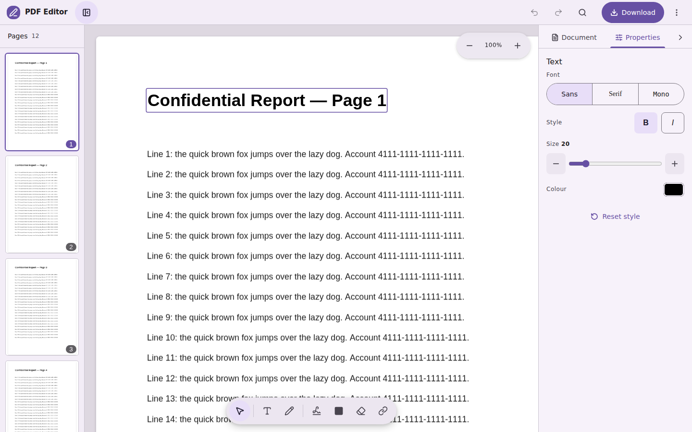
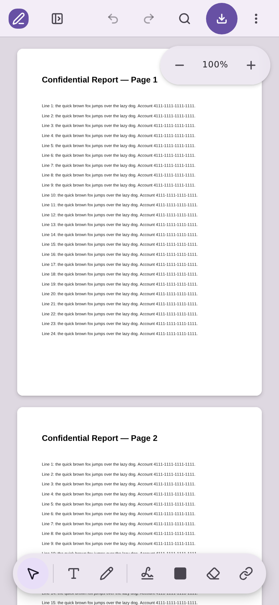

# PDF Editor

A full client-side PDF editor: edit and restyle text, add text, draw and
annotate, sign, redact, organize pages, and add finishing touches — then
download the result. Everything runs **entirely in your browser**. No server,
no uploads, no accounts.



## Design & platforms

The UI is built on **Material 3 Expressive** design tokens (color roles with
light/dark, the expressive shape scale, the M3 type scale, and motion easings)
and is **mobile- and tablet-first**:

- **Responsive shell** — a bottom app bar + extended FAB + bottom-sheet
  properties on phones; a tool rail + persistent side panel on tablet/desktop.
- **Touch-first canvas** — one finger pans/scrolls (never edits by accident),
  two fingers pinch-zoom, double-tap toggles fit ⇄ 2×, with app-managed
  zoom anchoring and 48px touch targets / enlarged drag handles on touch.
- **Self-contained** — the bundled [Lucide] icon set and the platform's own UI
  font, with **no CDN, web font, or third-party request of any kind**, so the UI
  renders identically offline, on a locked-down network, and without telling
  anyone you opened it.
- **Light / dark / system theme** — a toggle in the app bar; the choice is
  remembered and applied before first paint (no flash), and *system* follows
  the OS live.
- **Custom tooltips** for icon-only actions (fast, on-brand; skipped on touch).



## Features

- **Edit existing text** — click any text run and type over it in place. Your
  replacement keeps the document's own typeface and weight, both on screen and
  in the downloaded file.
- **Restyle text** — change font (Sans / Serif / Mono), **bold**, *italic*,
  size, and colour for the selected text or text box.
- **Add new text** — the *Add text* tool drops a text box anywhere you click.
- **Move & resize** — drag text boxes and redactions to reposition them, and
  drag their handles to resize (redactions resize as a rectangle; text boxes
  scale their font size).
- **Annotate & draw** — highlighter, freehand pen, shapes (rectangle / line /
  arrow), and sticky notes, with adjustable colour and stroke width.
- **Fill & Sign** — create a signature by drawing, typing (script font), or
  uploading an image, then tap to place it; insert any image the same way.
  Stamps are draggable and resizable.
- **Redact** — the *Redact* tool draws a solid box over a region and truly
  removes the underlying content on export (see below).
- **OCR a scan** — *OCR — recognise text* reads an image-only PDF and adds an
  invisible text layer, so a scan becomes searchable, selectable, and
  redactable. Runs entirely on-device: the engine and the language model are
  served from this app's own origin, never a CDN.
- **Organize pages** — a thumbnail view to reorder, rotate, and delete pages,
  merge in another PDF, or extract selected pages to a new file.
- **Finishing touches** — add page numbers, stamp a diagonal watermark, or
  export every page as a PNG image.
- **Undo / redo** — full history with <kbd>Ctrl/⌘</kbd>+<kbd>Z</kbd> and
  <kbd>Ctrl/⌘</kbd>+<kbd>Shift</kbd>+<kbd>Z</kbd> (continuous gestures like
  dragging, resizing, and typing collapse into single steps).
- **Download** — writes your changes back to a new PDF, preserving everything
  you didn't touch.
- **Remembers your preferences** — new text boxes inherit your last font / size
  / colour, the draw tool and style persist across sessions, and signatures are
  saved to a small reusable gallery (all in `localStorage`; a "Reset style"
  action clears the text defaults).

Everything runs locally with the [File API]; the PDF never leaves your machine.

## Accessibility & keyboard

- **Visible focus** — every control shows a clear focus ring for keyboard and
  assistive-tech users; **48px touch targets** on primary controls.
- **Keyboard** — single-key tool shortcuts (**V** select, **T** text, **D**
  draw, **S** sign, **R** redact), <kbd>Esc</kbd> to clear the selection or
  close a dialog, arrow keys to nudge a selected redaction/stamp/annotation
  (<kbd>Shift</kbd> for a larger step), and full undo/redo shortcuts.
- **Dialogs** trap focus, close on <kbd>Esc</kbd>, restore focus on close, and
  dismiss with the platform **Back** gesture/button (Android/iOS/browser).
- **Status is announced** via ARIA live regions; page loads show a skeleton.
- **Zoom is never blocked** — browser/OS zoom and Dynamic Type stay available —
  and motion honors `prefers-reduced-motion`.
- **Unsaved-work guard** warns before you close or reload with pending edits.
- **Dim pages** (overflow menu) softens the white page canvas to cut glare in
  dark mode; preview only, never baked into the export.

## How it works

1. **Render** — [PDF.js] rasterises each page to a `<canvas>` and extracts the
   text fragments with their exact positions. Once a page has painted, its
   fonts are read back from PDF.js so an edited fragment can be shown in the
   document's own face rather than a generic stand-in.
2. **Edit** — each fragment gets a transparent `contentEditable` overlay
   aligned to its glyphs. Editing or restyling a fragment paints an opaque box
   over the original so the preview matches the export. New text boxes and
   redactions are tracked as overlays too.
3. **Export** — [pdf-lib] produces the output page by page:
   - Pages **without** redactions keep their original vector content; edits and
     new text boxes are drawn on top (original glyphs are covered and redrawn,
     in the document's own font — re-embedded and subset — where possible).
   - Pages **with** redactions are flattened: the page is re-rendered to a
     high-resolution image with all edits, text boxes, and redaction fills
     baked in, and that image replaces the page. Because only the raster
     survives, redacted content is genuinely gone — there is no hidden text
     layer to recover.

## Getting started

```bash
npm install
npm run dev      # start the dev server
npm run build    # type-check + production build to dist/
npm run preview  # serve the production build

npm test         # Playwright end-to-end suite against dist/
```

Then open the printed URL and drop in a PDF.

`npm test` runs in a real browser against the production build, and covers the
properties a type-checker can't see: that no request leaves the origin, that the
CSP is in force, that a redacted page really has no recoverable text layer, that
no `javascript:` URI or authoring metadata reaches an exported file, that a long
document doesn't rasterise itself end to end, that OCR reads a scan from
same-origin assets, and that the phone layout doesn't collide. Run it after
`npm run build` (CI does both on every push and PR).

## Deployment

The app is a static client-side bundle, deployed to **GitHub Pages** by the
workflow in [`.github/workflows/deploy.yml`](.github/workflows/deploy.yml) on
every push to `main`.

Live site: **https://b-ismark.github.io/pdf-editor/**

First-time setup (once per repo): in **Settings → Pages**, set **Source** to
**GitHub Actions**. After that, each push to `main` rebuilds and redeploys
automatically. `vite.config.ts` uses a relative `base` (`"./"`) so assets
resolve correctly under the project subpath.

## Analytics & privacy

The app itself collects **nothing** — no analytics, no telemetry, no cookies,
no external calls. Your PDFs and edits never leave your browser, by design.

That's enforced, not just intended. The page ships a **Content-Security-Policy**
with `default-src 'self'` and `connect-src 'self'`, so the browser itself blocks
any request to an outside host — including one a future dependency might try to
make. There are no web fonts and no CDN references, so opening the app makes
exactly one set of requests, all to the origin serving it. `npm test` asserts
this in a real browser, and CI runs it on every push and pull request.

Two things are stored locally, both under your control:

- **Preferences** (`localStorage`) — theme, last text style, draw tool, saved
  signatures.
- **A session copy** (IndexedDB) — the open PDF and your edits, so a crash or an
  accidental reload doesn't lose your work. Because that's a real copy of your
  document on the device, the overflow menu has a **Save session on this device**
  toggle; switching it off deletes what's already stored. The restore prompt also
  offers **Delete** alongside **Restore**.

Downloaded files are scrubbed before you get them: document metadata, timestamps,
XMP, embedded JavaScript and files, auto-run actions, and any annotation action
that isn't a plain link are all stripped, and link URLs are limited to
`http(s)`, `mailto:` and `tel:` so an exported PDF can't carry active content.

To get a rough sense of usage without breaking that promise, use GitHub's
built-in traffic stats: on the repository, open **Insights → Traffic** to see
**unique visitors** and page views for the last 14 days. Because there are no
accounts, this counts unique browsers/devices rather than distinct people, and
it's measured server-side by GitHub Pages — nothing is added to the app itself.

## Using the editor

| Tool | What it does |
| --- | --- |
| **Select** | Click any element to edit/restyle it via the properties panel; drag to move, drag a handle to resize; Delete removes it. |
| **Add text** | Click anywhere on a page to drop a new text box, then type. |
| **Draw** | Opens a sub-toolbar: highlighter, pen, rectangle, line, arrow, sticky note, with colour and width. |
| **Sign** | Create a signature (draw / type / upload) and tap the page to place it. |
| **Redact** | Drag a rectangle over the content to remove. Pick its fill colour in the properties panel. |

The overflow menu (⋮) holds document tools: **Organize pages**, **Add image**,
**Page numbers**, **Watermark**, and **Export as images** — plus **Open another
PDF** and **Close document**.

To leave a document, click the **PDF Editor** brand in the app bar (or use
**Close document**): it returns you to the start screen, asking first if you
have unsaved changes.

Undo/redo is available from the toolbar (↶ ↷) or the keyboard
(<kbd>Ctrl/⌘</kbd>+<kbd>Z</kbd> / <kbd>Ctrl/⌘</kbd>+<kbd>Shift</kbd>+<kbd>Z</kbd>).

## Project layout

```
src/
  theme.css       Material 3 Expressive design tokens (color/shape/type/motion)
  pdf/
    types.ts      shared TypeScript types
    style.ts      font/style resolution + colour helpers
    fontInfo.ts   the document's own font per fragment, read back after render
    loader.ts     parse + render pages with PDF.js (+ document cache)
    exporter.ts   write edits/text/redactions/annotations/stamps with pdf-lib
    pageOps.ts    reorder/rotate/delete/merge/extract via pdf-lib
    finishOps.ts  page numbers, watermark, render-to-image
  hooks/
    useHistory.ts undo/redo stack with gesture coalescing
    useDrag.ts    pointer-drag helper + shared drag lock
    useViewport.ts fit-to-width scale + pinch/wheel/double-tap zoom
    usePageFonts.ts subscribe to a page's harvested fonts (see pdf/fontInfo)
  components/
    Icon.tsx              inline SVG icon set
    PageView.tsx          one page: canvas + editable/annotation overlay + tools
    EditableFragment.tsx  a single in-place editable text run
    TextBoxItem.tsx       a user-added text box (draggable/resizable)
    RedactionItem.tsx     a redaction rectangle (draggable/resizable)
    AnnotationLayer.tsx   SVG layer for highlight/pen/shapes
    NoteItem.tsx          a sticky note
    StampItem.tsx         a placed signature/image (draggable/resizable)
    DrawToolbar.tsx       contextual draw sub-toolbar
    SignatureDialog.tsx   draw / type / upload a signature
    FinishDialog.tsx      page numbers + watermark options
    Organize.tsx          page thumbnail organizer
    Thumbnail.tsx         a page thumbnail
    PropertiesPanel.tsx   contextual controls (M3)
  App.tsx         responsive shell, viewer, tool orchestration
```

## Limitations

A pragmatic, client-side editor — worth knowing where the seams are:

- **Text edits on non-redacted pages are drawn over, not deleted.** An edited
  fragment is covered with a white rectangle and the new text is drawn on top;
  the original glyphs still exist in the content stream. Use **Redact** (which
  flattens the page) if you need content to actually be removed.
- **Redacting flattens the whole page to an image.** That page loses its
  selectable text layer and its file size grows. Pages you don't redact keep
  full vector quality and selectable text.
- **Fonts are kept where they can be, approximated where they can't.** Edited
  text is previewed and written in the document's own typeface (re-embedded,
  subset to the glyphs used). It falls back to the closest standard font —
  Helvetica / Times / Courier, with bold & italic — when you pick a different
  font yourself, or when the original has no glyph for something you typed.
  Text drawn with a standard font supports only WinAnsi-encodable characters.
- **White background assumed** behind edited text on non-redacted pages;
  coloured or image backgrounds will show a white patch. (Redaction fill colour
  is configurable.)
- **Layout is not reflowed**, and images/vector graphics aren't editable, nor is
  rotated text repositioned in the overlay.
- **Scanned PDFs have no text layer** until you run **OCR — recognise text**
  from the overflow menu, which adds one on-device (see below). Recognition is
  good, not perfect: check anything you intend to redact.
- **Page numbers / watermark / organize** rebuild the document, so they bake in
  (and reset) the current text edits — do them as a finishing step.
- **No password encryption.** pdf-lib can't write encrypted PDFs, so that's out
  of scope for this server-free build.

## Tech

React · TypeScript · Vite · [PDF.js] · [pdf-lib]

[File API]: https://developer.mozilla.org/en-US/docs/Web/API/File
[PDF.js]: https://mozilla.github.io/pdf.js/
[pdf-lib]: https://pdf-lib.js.org/
[Lucide]: https://lucide.dev/
